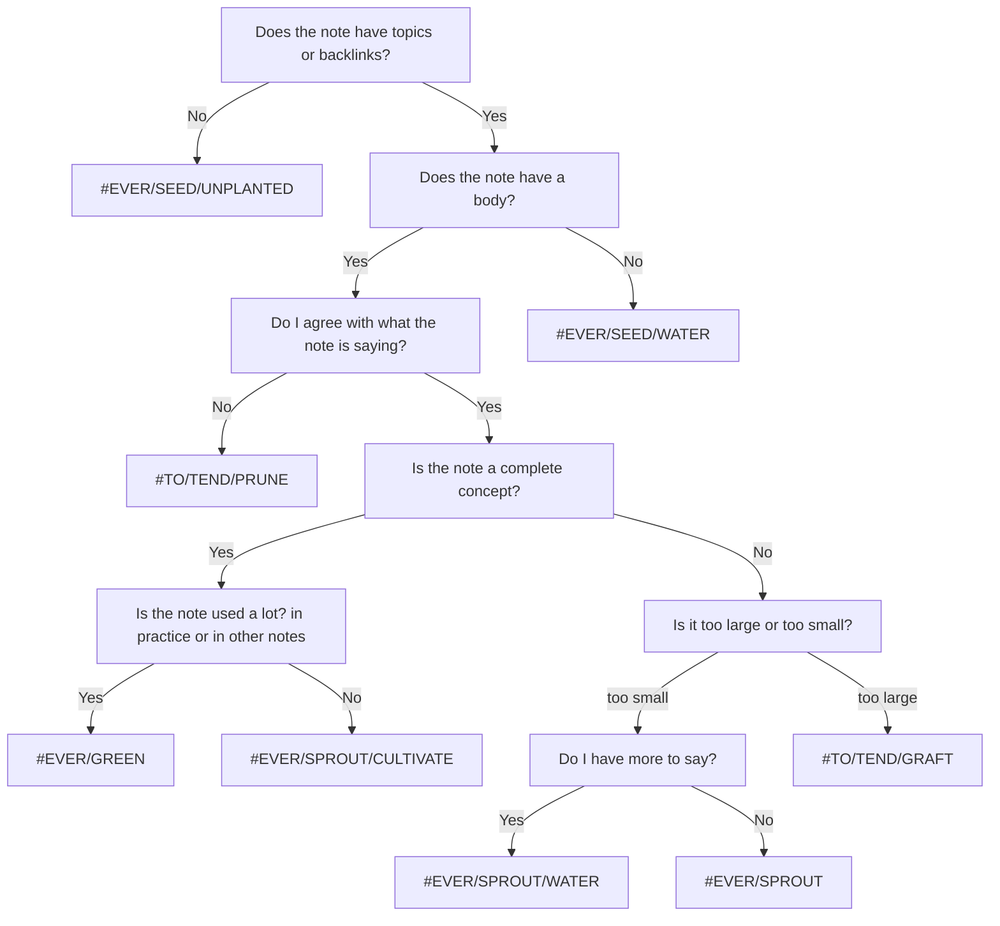

From [[my TO(DO) and EVER(GREEN) structure]]

This structure is designed to help classify what the state of an [[evergreen notes|evergreen note]] is. [^1] These are not strict and are more done by feel, but do help me decide when and how to work on a note. 

[^1]: [[Evergreen notes should be constantly integrating new knowledge]]

- **\#EVER** see all the [[evergreen notes]] in [[Obsidian (software)]]
	- Seeds essentially functions as my writing inbox. If it doesn't have a body or links it cannot store for long and needs to be looked at.
	- **\#EVER\/SEED** a seed of thought which could lie dormant or could flower quickly
		- **\#EVER\/SEED/UNPLANTED** has no links into the [[web of thought]]
		- **\#EVER\/SEED/WATER** has no body
	- Once I have gotten my initial thoughts out I like to let notes mature so I can find opportunities to link them elsewhere and  be certain they remain [[conceptual notes|conceptual]]. 
	- **\#EVER/SPROUT** a concept that has information and value, but I have no current intention of expanding
		- **\#EVER/SPROUT/WATER** I have [[source notes]] or ideas that I want to add 
		- **\#EVER/SPROUT/CULTIVATE** needs to looked at in relation to other notes, or requires citation or outside content
	- **\#EVER/GREEN** concept that holds weight, value, and [[knowledge]] in the [[second brain]]
		- **\#EVER/GREEN/GROWING** This is a note that has the solid base of a concept and is interlinked with the [[second brain]], but many of those links need water, or are unplanted. This note is not ever/green because the notes linked within in it are actively changing, and that may require to work on the ever/green
		- **\#EVER/GREEN/PRUNE** [[evergreen notes]] that needs to be looked at and rethought through in the context of the [[second brain]]. May include adding and removing connections, separating out distinct concepts into their own notes and removing inaccurate information

In practice, this is how I assign status:
