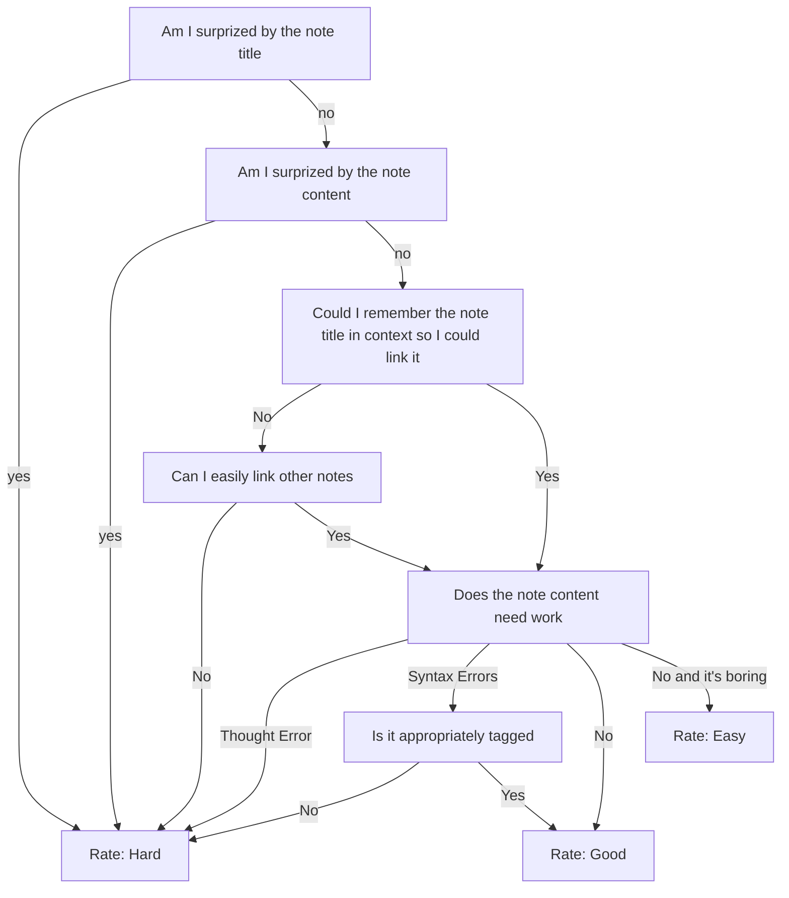
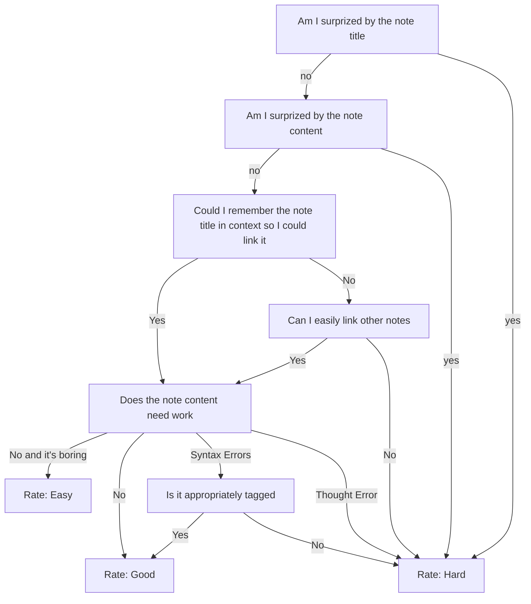

#### [[What makes a note evergreen]] `$=customJS.dv_funcs.evergreenHeader(dv, this)`

[[My TO(DO) and EVER(GREEN) structure]] details how I add statuses and action items to [[evergreen notes]] in [[My TIM]]. In these I am constantly contemplating is this note evergreen? and how do I make this note more evergreen? So what does being evergreen even me to me?

- [[Evergreen notes organize knowledge so that it can grow]]
- [[Conceptual notes are lexically superior to atomic notes]]
- [[Write your notes like you're planting an evergreen forest]]
- contrast
    - [[The fragility of nodes in a second brain]]
    -  [[When in doubt, write what you think]]
- [[What is the difference between a evergreen note and a topic note]]

##### Thoughts as I process notes
- [[spaced repetition]]
    - Could I remember this note if it was relavant? 
    - Have I remembered this note recently?
    - Have I been thinking about this note recently
    - Do I want to not see this note again
- [[Use spaced repetition as weeding for your digital garden]]
- [[Use spaced repetition as a memory tool for your second brain]]
- Status
    - note has topics > unplanted
        - note has body > seed/water
            - I disagree with what this note says < sprout
            - I agree with what this note is saying >= sprout
                -  I am happy with the way I am saying it = green
                -  I don't like how I'm saying it >= sprout
                    -  this note has a lot of backlinks >= sprout
                    -  note has more backlinks than forward links = green

# How I rate notes during daily spaced repetition refv

- [ ] #TO/DO/CREATE flow chart, [[Mermaid (software)]]?
 
### 

**Status**:: #EVER/SPROUT/WATER 
*edited `=this.file.mtime`*

**Topics**:: [[evergreen notes]], [[note writing]], [[My TIM]]
*`$=customJS.dv_funcs.outlinedIn(dv, this)`*
