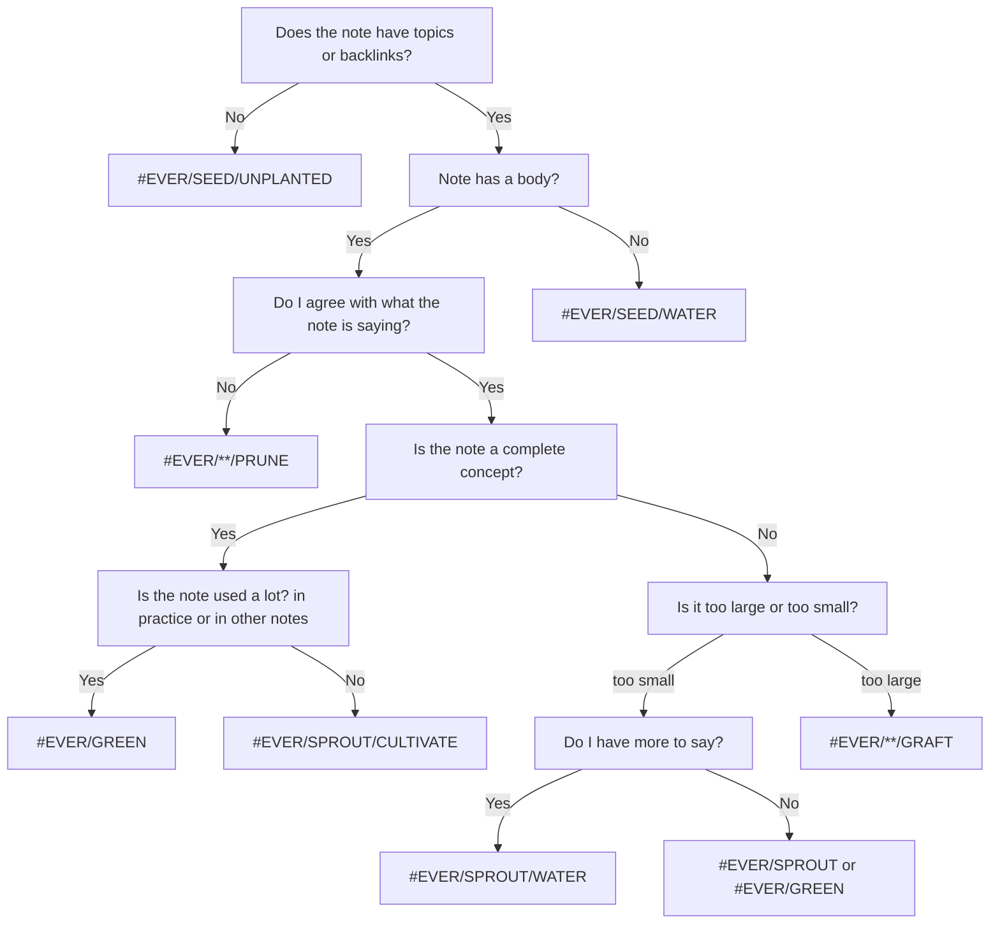

#### [[What makes a note evergreen]] `$=customJS.dv_funcs.evergreenHeader(dv, this)`

[[My TO(DO) and EVER(GREEN) structure]] details how I add statuses and action items to [[evergreen notes]] in [[My TIM]]. In these, I am constantly contemplating is this note evergreen? and how do I make this note more evergreen? So what does being evergreen even me to me?

In practice, this is how I assign status:

What is the inuition that drives this process? 
- [[Evergreen notes organize knowledge so that it can grow]]
- [[Conceptual notes are lexically superior to atomic notes]]
- [[Write your notes like you're planting an evergreen forest]]
- contrast
    - [[The fragility of nodes in a second brain]]
    -  [[When in doubt, write what you think]]

### 

**Status**:: #EVER/SPROUT/GRAFT 
*edited `=this.file.mtime`*

**Topics**:: [[evergreen notes]], [[note writing]], [[My TIM]]
*`$=customJS.dv_funcs.outlinedIn(dv, this)`*
