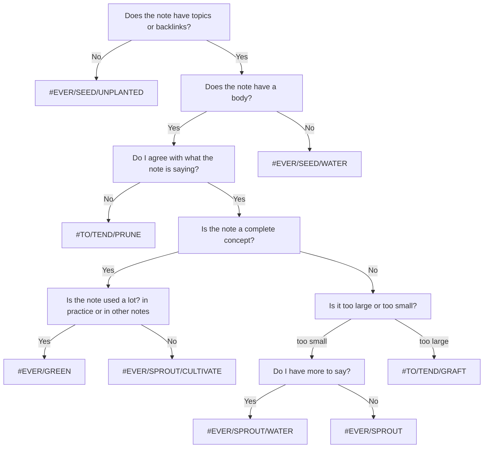

#### [[my TO(DO) and EVER(GREEN) structure]] `$=customJS.dv_funcs.evergreenHeader(dv, this)`

This structure could be applied to any system, but it works best in [[Obsidian (software)|Obsidian]], or other systems that treat tags the same way. In Obsidian tags can filter backlinks, the graph view, and be used with many plugins. Additionally when used in search queries they surface and filter notes. This makes tags useful as both a classifier of note type, and a way to mark work items: [[Use Obsidian tags as temporal classifiers]]

##### \#TO(DO)

**\#TO** tags should be used for specific items, not general tasks like "review notes" or "write this paper." This means they are a not daily todo list, they are a way to specify a task inline to to be done in the future. These tags should be temporary, but they are not scheduled. The hierarchical structure lets me focus in when I have specific kinds of things I want to do, or look broader when I just have some time to work on my vault.

This is an incomplete list, and new categories can be added whenever it feels necessary. 

- **\#TO**
    - **\#TO/TEND** tasks relating to [[evergreen notes]] that do not require leaving [[Obsidian (software)|Obsidian]]
	    - **\#TO/TEND/GRAFT** Formalize or conceptualize a connection
	    - **\#TO/TEND/PRUNE** Cut of parts that are outside the concept
	    - **\#TO/TEND/WEED** Fix syntax errors
	- **\#TO/DO** 
		- **\#TO/DO/WRITE** write a specific item, not used for need to write or expand an evergreen note
		- **\#TO/DO/PROGRAM** 
		- **\#TO/DO/REFERENCE** the source is there but unreferenced
		- **\#TO/DO/FIND** remember source but don't have easy access
	- **\#TO/EXPLORE**
		- **\#TO/EXPLORE/READ** 
		- **\#TO/EXPLORE/WATCH**
		- **\#TO/EXPLORE/RESEARCH** 
	- **\#TO/PONDER** ideas or concepts that require deep thought.
		- **\#TO/PONDER/ME** 
		- **\#TO/PONDER/SOCIETY**
	- Optionally if you enjoy looking back your daily accomplishments modify your tags in this way (leave the last part). You can then order search by last modified
	- **\#TO/DONE** 
	- **\#TO/EXPLORED**
	- **\#TO/PONDERED**
 

##### \#EVER(GREEN)

This structure is designed to help classify what the state of an [[evergreen notes|evergreen note]] is. [^1] These are not strict and are more done by feel, but do help me decide when and how to work on a note. 

[^1]: [[Evergreen notes should be constantly integrating new knowledge]]

- **\#EVER** see all the [[evergreen notes]] in [[Obsidian (software)]]
	- Seeds essentially functions as my writing inbox. If it doesn't have a body or links it cannot store for long and needs to be looked at.
	- **\#EVER\/SEED** a seed of thought which could lie dormant or could flower quickly
		- **\#EVER\/SEED/UNPLANTED** has no links into the [[web of thought]]
		- **\#EVER\/SEED/WATER** has no body
	- Once I have gotten my initial thoughts out I like to let notes mature so I can find opportunities to link them elsewhere and  be certain they remain [[conceptual notes|conceptual]]. 
	- **\#EVER/SPROUT** a concept that has information and value, but I have no current intention of expanding
		- **\#EVER/SPROUT/WATER** I have [[source notes]] or ideas that I want to add 
		- **\#EVER/SPROUT/CULTIVATE** needs to looked at in relation to other notes, or requires citation or outside content
	- **\#EVER/GREEN** concept that holds weight, value, and knowledge in the [[second brain]]
%%		- **\#EVER/GREEN/GROWING** This is a note that has the solid base of a concept and is interlinked with the [[second brain]], but many of those links need water, or are unplanted. This note is not ever/green because the notes linked within in it are actively changing, and that may require to work on the ever/green
		- **\#EVER/GREEN/PRUNE** [[evergreen notes]] that needs to be looked at and rethought through in the context of the [[second brain]]. May include adding and removing connections, separating out distinct concepts into their own notes and removing inaccurate information%%

In practice, this is how I assign status:

### 

**Status**:: #EVER/GREEN
*edited `=this.file.mtime`*

**Topics**:: [[second brain]], [[Obsidian (software)]]
*`$=customJS.dv_funcs.outlinedIn(dv, this)`*
