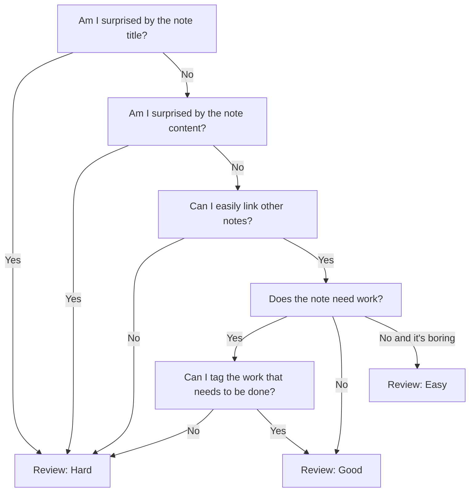

# [[Using spaced repetition for your conceptual notes]] `$=customJS.dv_funcs.evergreenHeader(dv, this)`

Spaced repetition is an extremely powerful tool to review [[conceptual notes]]. These are the ways I have found most useful:
1. [[Use spaced repetition as a memory tool for your second brain]]
2. [[Use spaced repetition to weed your digital garden]]

Over the last month I have worked through ~200 [[evergreen notes]] using [[spaced repetition]], and the process has been very fruitful. Overall, I doubled the average amount of links per note from 7 to 14, and created almost 20 notes just based on connections I was making within my existing notes.

I decided early on that I would use spaced repetition as a memory tool for my [[second brain]] and not an [[incremental writing]] tool, although I may explore that more in the future. This doesn't mean I stopped myself from writing while reviewing my notes, but unless I have inspiration on the spot, I am not pushing myself to write. The point is to stengthen the connections of nodes in [[second brain]] because that is how I use it to remember things
^[[[Nodes in the second brain are an abstraction of our first brain]]]
and grow my knowledge.
^[[[Evergreen notes organize knowledge so that it can grow]]]
This means adding links to other notes, todo items, and updating any metadata like note status.

## How I rate notes during daily spaced repetition review

[[Spaced Repetition (plugin)]] offer's three different levels of difficulty when reviewing notes: easy, good, and hard. These will set an interval of time before you review the note again. The interval is based on the note's previous difficulty and interval. Since I am using spaced repitition as a memory tool, I base my rating on how easily I could theoretically remember the note in context. This is mainly an intuitive process, but some hard rules have formed.

This process heavily leverages [[my TO(DO) and EVER(GREEN) structure]], and the interlinked nature of [[evergreen notes]]: [Evergreen notes should be densely linked](https://notes.andymatuschak.org/z2HUE4ABbQjUNjrNemvkTCsLa1LPDRuwh1tXC) 

While I am reviewomg, I take the time to add links and tags, because making those connections will help both my first brain and my second brain remember. I also will take time to clean up syntax and paragraph structure, because I also [[use spaced repetition to weed your digital garden]]. 

## Challenges

When I started, I had about 200 [[evergreen notes]] that spanned four major content areas. While one of the major benefits was the connections I was able to make across content areas, multiple times I ran into old notes I had forgotten about that I wish I would have reviewed a week or two before. This is mainly a symptom of doing the first pass through with spaced repetition, but I might suggest you first review by content area, before reviewing all at once, if you have more than 200 notes or a lot of older notes. 

While I wasn't pushing myself to write, because I was unconvering lots of old notes, I had lots of new thoughts to add to them, and I was adding a lot of content to notes based off of connections I was making. While this did slow down the review process, overall it was a positive symptom. The only time it was a problem was when I added thoughts that already existed in other notes, but as I reviewed more notes, this happened less and less.

## Conclusion 

[[Spaced repetition]] is like fertalizer for evergreen notes and is an essential practice in a [[second brain]]. It helps you create, maintain, and refine connections between notes, which makes [[Your second brain should be an inspirational hub of creativity| your second brain a hub of creativity]]. It is also extremely helpful in reducing the friction of maintaining [[evergreen notes]], and helps make [[Your second brain should be frictionless access to a curated base of knowledge| your second brain frictionless access to your knowledge base]]. 

In the future, I will be exploring using spaced repetition as a way to review [[source notes]], and see if it can be and [[Make your inbox into an entry point| entry point into the second brain]]. 

I think this practice will be helpful for any system that uses conceptual notes, and would love to hear and see others experiences.
