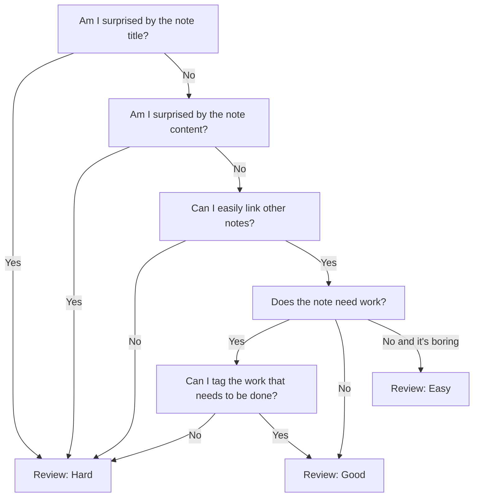

> [!infobox]
`$=customJS.dv_funcs.mentionedIn(dv)`

# [[Using spaced repetition for your conceptual notes]] 

Over the last month I have worked through ~200 [[evergreen notes]] using [[spaced repetition]], and the process has been very fruitful. Overall, I doubled the average amount of links per note from 7 to 14, and created almost 20 notes just based on connections I was making within my existing notes.

I decided early on that I would use spaced repetition as a memory tool for my [[second brain]] and not an [[incremental writing]] tool, although I may explore that more in the future. This doesn't mean I stopped myself from writing while reviewing my notes, but unless I have inspiration on the spot, I am not pushing myself to write. The point is to strengthen the connections between the nodes in my [[second brain]] and grow my knowledge. This means I take the time to add links and tags, and I will also will take time to clean up syntax and paragraph structure. This leads to two ways I have found [[spaced repetition]] to be useful so far.
1. [[Use spaced repetition as a memory tool for your second brain]]
2. [[Use spaced repetition to weed your digital garden]]
 
This process heavily leverages [[my TO(DO) and EVER(GREEN) structure]], and the interlinked nature of [[evergreen notes]]
^[[Evergreen notes should be densely linked](https://notes.andymatuschak.org/z2HUE4ABbQjUNjrNemvkTCsLa1LPDRuwh1tXC)]
to create connections and structures that work with our brain rather than against our brain: [[A second brain should mirror how we think]]

## How I rate notes during daily spaced repetition review

[[Spaced Repetition (plugin)]] offer's three different levels of difficulty when reviewing notes: easy, good, and hard. These will set an interval of time before you review the note again. The interval is based on the note's previous difficulty and interval. Since I am using spaced repitition as a memory tool, I base my rating on how easily I could theoretically remember the note in context. This is mainly an intuitive process, but some hard rules have formed.

## Challenges

When I started, I had about 200 [[evergreen notes]] that spanned four major content areas. While one of the major benefits was the connections I was able to make across content areas, multiple times I ran into old notes I had forgotten about that I wish I would have reviewed a week or two before. This was mainly a symptom of doing the first pass through with spaced repetition, but I might suggest you first review by content area, before reviewing all at once, if you have a wide variety or a lot of older notes. 

While I wasn't pushing myself to write, because I was uncovering lots of old notes, I had lots of new thoughts to add to them, and I was adding a lot of content to notes based off of connections I was making. While this did slow down the review process, overall it was a positive symptom. The only time it was a problem was when I added thoughts that already existed in other notes, but as I reviewed more notes, this happened less and less.

## Conclusion 

 [[Spaced repetition]] is like fertilizer for evergreen notes and is an essential practice in a [[second brain]]. It helps you create, maintain, and refine connections between notes, which makes [[Your second brain should be an inspirational hub of creativity| your second brain a hub of creativity]]. It is also extremely helpful in reducing the friction of maintaining [[evergreen notes]], and helps make[[Your second brain should be frictionless access to a curated base of knowledge| your second brain frictionless access to your knowledge base]]. 

In the future, I will be exploring using spaced repetition as a way to review [[source notes]], and see if it can be a [[Make your inbox into an entry point by integrating it with your second brain| entry point into the second brain]]. 

I think this practice will be helpful for any system that uses conceptual notes, and would love to hear and see others experiences.

# Progress and updates after four months of use

After continuing to use this system my [[understanding]] and use of it has evolved, and I have realized that I could have shared more specifics into how this synergizes with other systems that I use. While I mention my tagging system above, at the time I did not realize how *key* it was to *developing* notes, not just connecting them. While just using spaced repetition as described above will massively benefit your ability to connect and make insights between notes, without work from your end, it isn't going to develop notes on your own. This should be fairly unsurprising, but for me it mine first month of using it, it did almost feel like that.

In brief, [[my TO(DO) and EVER(GREEN) structure]] is system that is designed to make *developing* your notes easier **over time.** 
It does this by offloading the [[information]]
of what you want to work on in your notes and when
from your [[working memory]].
It does this by offloading a lot of the decisions that need to be made about notes, to future you.
There are benefits and downsides to this approach.

## What to actually do between opening a note and reviewing it 

#TO/TEND/WATER 
![[Pasted image 20220126143341.png]]

![[Pasted image 20220126143414.png]]
## Why this system works so well

## What are the limitations of this system