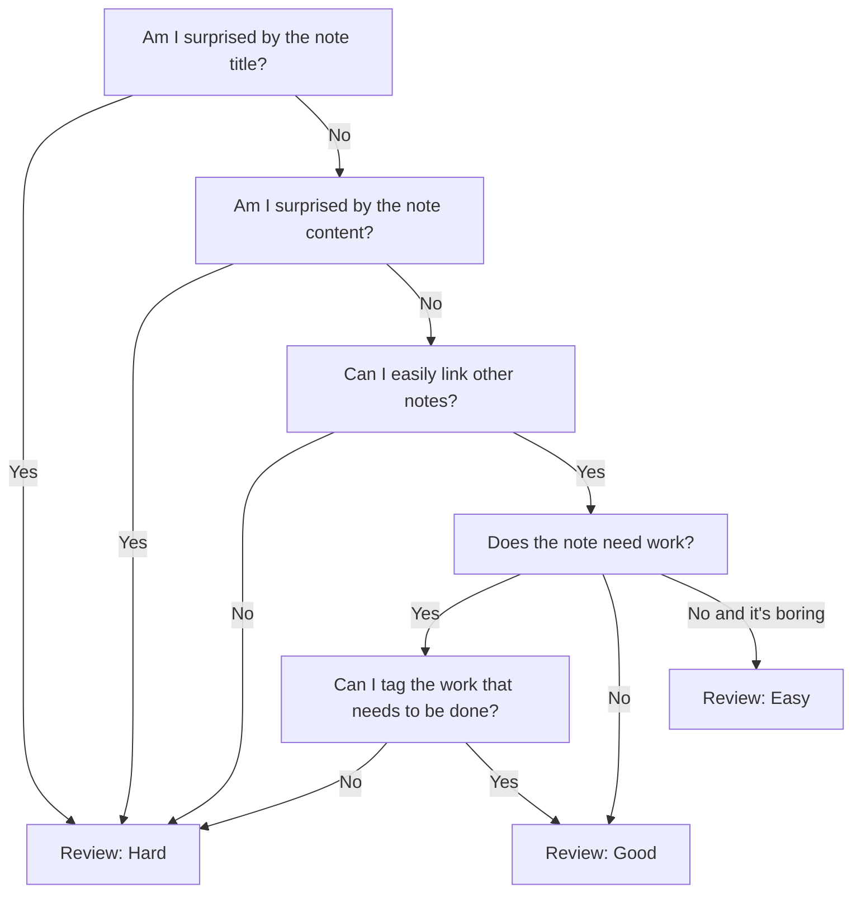

# [[Using spaced repetition for your conceptual notes]] `$=customJS.dv_funcs.evergreenHeader(dv, this)`

Over the last month I have worked through ~200 [[evergreen notes]] using [[spaced repetition]], and the process has been very fruitful. I decided early on that I would use spaced repetition as a  [[Use spaced repetition as a memory tool for your second brain|memory tool for my second brain]] and not an [[incremental writing]] tool, although I may explore that more in the future. This doesn't mean I stop myself from writing while reviewing my notes, but unless I have inspiration on the spot, I am not pushing myself to write. The point is to stengthen the connections of nodes in [[second brain]] because that is how I use it to remember things
^[[[Nodes in the second brain are an abstraction of our first brain]]]
and grow my knowledge.
^[[[Evergreen notes organize knowledge so that it can grow]]]
This means adding links to other notes, todo items, and updating any metadata like note status.

# How I rate notes during daily spaced repetition review
[[Spaced Repetition (plugin)]] offer's three different levels of difficulty when reviewing notes: easy, good, and hard. These will set an interval of time before you review the note again. The interval is based on the note's previous difficulty and interval. Since we are using spaced repitition as a memory tool, we base our rating on how easily we could theoretically remember the note. This isn't an exact science, but this is the general process that I follow:

This process heavily leverages [[my TO(DO) and EVER(GREEN) structure]], and the interlinked nature of [[evergreen notes]]: [Evergreen notes should be densely linked](https://notes.andymatuschak.org/z2HUE4ABbQjUNjrNemvkTCsLa1LPDRuwh1tXC) 